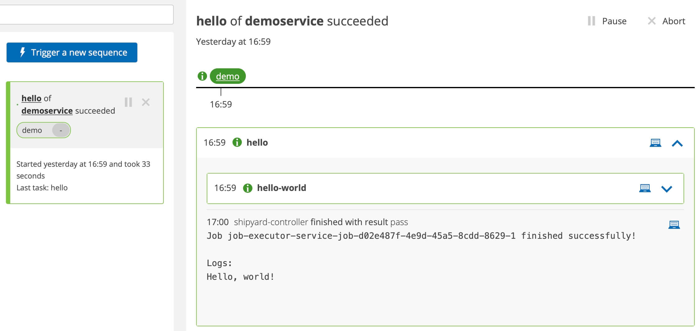



# First Steps After Installation

Head to the [keptn's bridge](http://localhost/bridge). Notice one project `helloworld` which has one stage `demo`. [Go to the sequence view](http://localhost/bridge/project/helloworld/sequence) for the project and click the sequence. the sequence has completed successfully and the log output is `Hello, world!`

During installation you provided a Git upstream repo. This is used as the "backing storage" for keptn. Every change is recorded in this Git upstream.

The installer created a keptn project which is defined in the `shipyard.yaml` file stored in the `main` branch of the upstream. A shipyard file defines your environment ([more details here](https://keptn.sh/docs/{{ .site.keptn_docs_version }}/manage/shipyard/)). The shipyard also defines the available sequences and tasks that will execute. Right now there is only one stage: `demo` with one sequence: `hello` and that sequence has only one task: `hello-world`.

Keptn creates a seperate branch per stage. All configurations and files related to that stage are found under that branch. Keptn creates a folder for each service (`demoservice`).

> Note: Stages cannot currently be added, removed or renamed after project creation. This is a [known limitation](https://github.com/keptn/enhancement-proposals/pull/70)

----

## Executing Jobs

How exactly did the `Hello, world!` get there?

Along with keptn core microservices, one additional service was installed: the [job executor service](https://github.com/keptn-contrib/job-executor-service). This services is extremely flexible and allows keptn users to spin up any scripts (Python, bash or powershell) or any container. The job-executor was told to listen for the `sh.keptn.event.hello-world.triggered` event. In other words, when keptn requests that the task is executed, the job executor will action the task in response to that cloudevent.

### Sounds good. Show me

Switch to the `demo` branch and go to `demoservice/job/jobconfig.yaml`. The files shows the JES listens for `sh.keptn.event.hello-world.triggered` and in response, spins up an `alpine` container and executes `echo "Hello, world!"`.

> Play around with this file: Echo different words or run an entirely different container in response to the event.

## Nice, but let's do something useful

Excellent, you've seen how keptn allows bringing your own tools and decouples logic from tooling and are keen to progress.

[Head here](full-tour.md) next to build an artifact delivery platform using Helm with prometheus SLO-driven quality evaluations as standard. [Take me there](full-tour.md)...
